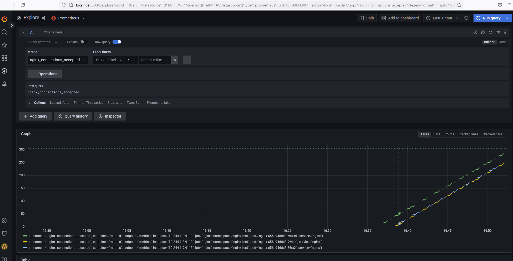

./kind delete cluster
./kind create cluster --config kind-config.yaml
kubectl config use-context kind-kind
helm repo add bitnami https://charts.bitnami.com/bitnami
helm repo update
./kubectl create ns monitoring
helm upgrade --install kube-prometheus --namespace=monitoring bitnami/kube-prometheus
./kubectl create ns nginx-test
helm upgrade --install nginx -nnginx-test bitnami/nginx -f nginx.values.yaml
helm upgrade --install grafana -nmonitoring bitnami/grafana

Руками добавил датасорс в графану и вуаля.

